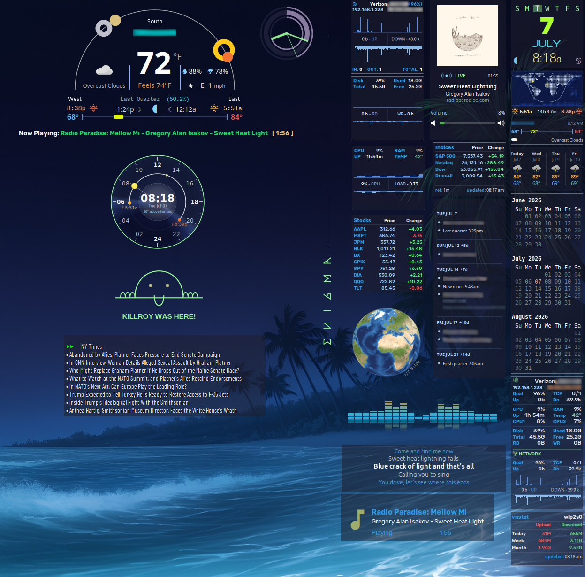

# Enigma Conky Suite

A modular collection of Conky widgets designed for a cohesive and interactive desktop experience.
Run everything together or each component independently.

* All components are **fully modular**
* Designed for **low clutter, high signal**
* Easily customizable and extendable
* Built on Linux Mint 22.3 / Cinnamon Edition

---



## Overview

| Category | Widgets |
|---|---|
| **Arc** | Arc (horizon, planets, sun/moon, weather) |
| **Calendar** | Multi-Month Calendar, Lua Calendar (espcal) |
| **Clock** | Sweep Ring Clock |
| **Combo** | Net/Sys/Disk combined widget (two variants) |
| **Disk** | Disk I/O Monitor |
| **Earth** | Satellite Earth Viewer |
| **Google Calendar** | Month-view (gcalcli + Lua) |
| **Indices** | Stock Indices |
| **Music** | Now Playing (album art + controls), Spectrum EQ, Synced Lyrics, Song Info, Now Playing Sidepanel |
| **Network** | Network Traffic Panel |
| **RSS** | Click-enabled Feed Viewer |
| **Solar Dial** | Solar position ring |
| **Stocks** | Stock price table |
| **System** | System Monitor |
| **vnstat** | Bandwidth Summary |
| **Weather** | NWS Forecast Strip, Temperature Bar |
| **World Map** | Day/night world map |

The **Earth Viewer** component is adapted from the *Aurora* set.

---

## Getting Started

Install Enigma:
````bash
cd ~/.conky
git clone https://github.com/rew62/enigma.git
cd enigma
````

`~/.conky/enigma` is the suite's default location — every widget falls back to
it when launched directly. If you clone somewhere else, launch through `etmux`
(which sets `ENIGMA_DIR` from its own location automatically) or export
`ENIGMA_DIR=/path/to/enigma` before running `conky -c` by hand.

Run the setup script:

```bash
./enigma-config.sh
```

This will:

* Optionally install or verify all dependencies via `apt`
* Create or update `.env` with:

  * `OWM_API_KEY` — OpenWeatherMap API key
  * `FINNHUB_API_KEY` — FinnHub API key (stocks widget)
  * `CITY_ID` — OWM city ID
  * `LAT` / `LON` — Latitude and longitude (auto-detected via GeoClue or IP geolocation if you accept the prompt)
  * `UNITS` — `metric` (Celsius) or `imperial` (Fahrenheit)
  * `LANG` — Language code (e.g. `en`, `fr`, `de`)
  * `ICON_SOURCE` — `cdn` or `local` weather icons
  * `CACHE_TTL` — Weather cache lifetime in seconds (default: 300)
  * `INTERFACE_NAME` — Network interface (auto-detected)
  * `DISK_DEV` — Disk device for I/O graphs (auto-detected)
* Optionally auto-detect your latitude/longitude via GeoClue (if available) or IP geolocation, pre-filling the `LAT`/`LON` defaults
* Install all bundled fonts from `fonts/` and run a font availability check
* Install the earth viewer cron job (runs at boot and every 10 minutes)

See `.env-example` for the format reference.

---

## Features

### Interactive RSS Feed

* Clickable articles using `xdotool`
* Toggle feeds via the double-arrow control
* Feeds configured in `scripts/rss_feeds.conf`

### Weather System

* Uses **National Weather Service (NWS)** data for forecast and **openweathermap.org (OWM) API** for current conditions
* OWM requires an API key — obtain one free at https://openweathermap.org/

### Stock Widgets

* `ticker.rc` — stock price table; requires a FinnHub API key (free at https://www.finnhub.io/). Symbol list is `widgets/stock-symbols.conf`, shared with `indices2.rc`'s expanded view below (same cache, so running both doesn't double the API calls).
* `indices2.rc` — market index display; top section pulls real index values from Yahoo's keyless chart API (symbol list is inlined in `widgets/indices2.lua`'s `YAHOO_SYMBOLS`), Left-click expands to the individual stocks in `stock-symbols.conf` via FinnHub.

### Arc Widget

* Includes current forecast and moon phase rendering
* Expanded from original github/@gtex62 design

### Modular Design

* Every widget runs independently:

  ```bash
  conky -c widgets/arc.rc
  ```

  (from any directory, provided the repo lives at `~/.conky/enigma` or
  `ENIGMA_DIR` is set — see [Getting Started](#getting-started))

### tmux Integration

* Launch the default group:

  ```bash
  ./etmux
  ```
* Stop everything:

  ```bash
  ./etmux quit
  ```

#### etmux — Selective Launch

`etmux` lets you launch any subset of widgets by passing short codes as arguments.
Up to 4 conky processes are grouped per tmux window; the layout is tiled automatically.
With no arguments it launches the `default` group. Use `etmux help` to list all codes.

**Usage:**

```bash
# Launch the default group
./etmux

# Launch specific widgets by code
./etmux a wf st r

# Launch a named group
./etmux stack1
```

**Named Groups:**

| Group | Codes |
|---|---|
| `default` | `c e ec ed em en es ev g m si wf wt zen` |
| `stack1` | `a sd st r t zkr` |
| `column1` | `ec em wt wf c ecg ev e` (auto-stacked, see below) |
| `column2` | `m si g` (auto-stacked, see below) |

**Widget Codes:**

| Code | File | Widget |
|---|---|---|
| `a` | `widgets/arc.rc` | Arc (horizon, planets, sun/moon, weather) |
| `c` | `widgets/multimon.rc` | Multi-month calendar |
| `e` | `widgets/enigma-earth.lua` | Earth satellite image viewer |
| `ec` | `widgets/espcal.lua` | Lua calendar (espcal) |
| `ecg` | `widgets/nsd2.lua` | Combined Net/Sys/Disk widget (combo summary + selectable graph) |
| `ed` | `widgets/disk.rc` | Disk I/O monitor |
| `eg` | `widgets/nsd.lua` | Combined Net/Sys/Disk widget (cycle-through views) |
| `em` | `widgets/worldmap.rc` | Day/night world map |
| `en` | `widgets/network.rc` | Network traffic panel |
| `eq` | `music2/eq.rc` | Spectrum equalizer (cava-driven) |
| `es` | `widgets/system.rc` | System monitor |
| `ev` | `widgets/vnstat-summary.rc` | vnstat bandwidth summary |
| `g` | `widgets/gcal.rc` | Google Calendar month-view |
| `m` | `music2/nowplaying.rc` | Now Playing (music2) |
| `mp` | `widgets/playerctl.rc` | Now Playing sidepanel |
| `msi` | `widgets/song-info.rc` | Song info (legacy) |
| `r` | `widgets/rss.rc` | RSS feed viewer |
| `sd` | `widgets/solar_dial2.lua` | Solar dial ring |
| `si` | `widgets/indices2.rc` | Stock indices |
| `st` | `widgets/ticker.rc` | Stock price table |
| `t` | `widgets/alien-clock2.lua` | Sweep ring clock |
| `wf` | `widgets/nws_forecast_small.rc` | NWS forecast strip |
| `wt` | `widgets/tempbar.rc` | Temperature bar |
| `zen` | `utils/enigma-logo.lua` | ENIGMA logotype |
| `zkr` | `utils/kroy.lua` | Killroy Was Here |

`etmux` also has shortcuts into the sibling `auzia-conky` and `conky-aurora` repos (`auzia`, `x-au-m`, `x-au-s`) -- see [Related Projects](#related-projects).

#### etmux — Auto-Stacked Columns

Any named group whose name starts with `column` launches as a vertical stack:
each widget is placed 5&nbsp;px below the one above it via `-x`/`-y` overrides,
using its real window height. The rc files are never modified — launched any
other way, every widget keeps its native coordinates.

```bash
./etmux column1
```

* **Order matters** — the group's code order is the top-to-bottom screen order.
* **Per-column position** — `COLUMN_X`/`COLUMN_Y` in `etmux` set where the
  column's window edge sits (X measured from the right screen edge, since the
  widgets are `top_right`-aligned). Each widget's `border_inner_margin` offset
  is corrected automatically.
* **Heights** come from, in order: a live computation for `multimon.rc` (so
  changing `NUM_MONTHS` in `scripts/multimon.sh` restacks correctly on the
  next launch), the last measured height published to
  `/dev/shm/enigma/heights/` by the running widgets, and finally a static
  fallback map in `etmux`.
* **Only column-width `top_right` widgets stack** (150–164 px window, which
  covers the 154 px family plus earth/nowplaying — right edges align since the
  column is right-anchored). Anything else in a column group (`a`, `sd`, ...)
  prints a notice and launches at its native position without reserving a slot.
* **Self-healing** — widgets that are already running are skipped but keep
  their slot, so re-running a column group only fills in the missing widgets
  at the right offsets. After changing a widget's height (months, symbols,
  ...), do a full `./etmux quit` and relaunch so everything below it moves.
* If a stack is taller than the display, `etmux` warns that the trailing
  widgets will be off-screen (it still launches them).

---

## Mouse Events

Every widget supports the same baseline window controls (via `scripts/window.lua`):

| Combination | Action |
|---|---|
| `Ctrl` + Left-click | Save the window's current position into its `.rc` file (`alignment = 'top_left'`, `gap_x`/`gap_y`) |
| `Ctrl` + Right-click | Kill that conky instance |
| `Alt` + drag | Move the window (handled by the window manager, not conky) |

A few widgets layer extra click behavior on top of that baseline:

| Widget | Combination | Action |
|---|---|---|
| `disk.rc` | `Shift` + Left-click | Toggle disk I/O graph on/off |
| `eq.rc` | Left-click / Right-click | Next / previous spectrum preset |
| `indices2.rc` | Left-click | Toggle expanded symbol view |
| `nsd.lua` | `Shift` + Left-click | Cycle views: net → sys → disk |
| `nsd.lua` | `Shift` + Right-click | Toggle combo summary (all three, no graphs) |
| `nsd2.lua` | Left-click | Cycle the graph: net → sys → disk |
| `rss.rc` | Left-click | Open headline in browser, or advance to next feed |

---

## Music2 — Now Playing, EQ & Lyrics

A self-contained subsystem in `music2/` with its own launcher (`music.sh`). Now Playing is also wired into `etmux` as code `m` (part of the `default` group); the eq and lyrics widgets are launched via `music.sh` or toggled from Now Playing. Three widgets share a common background panel but otherwise run independently:

| Script | Widget |
|---|---|
| `nowplaying.rc` | Now Playing — album art, title/artist/station, progress bar (or pulsing live-stream indicator), volume control |
| `eq.rc` | Spectrum equalizer (cava-driven) |
| `lyrics.rc` | Synced lyrics display |

**Launch / stop:**

```bash
cd music2
./music.sh start      # launches all three
./music.sh stop
./music.sh restart
```

**Mouse events (`nowplaying.rc` only):**

| Combination | Action |
|---|---|
| `Shift` + Left-click | Toggle the lyrics widget (`lyrics.rc`) on/off |
| `Shift` + Right-click | Toggle the eq widget (`eq.rc`) on/off |
| Left-click / scroll on the volume bar | Set or adjust system volume |
| Right-click anywhere in the volume section | Toggle mute |

---

## Directory and File Tree

```text
├── .env-example                        - environment variable reference
├── LICENSE
├── README.md
├── background.png
├── enigma-config.sh                    - interactive setup (deps, API keys, lat/lon, interface)
├── enigma.png
├── etmux                               - launch widgets via tmux (default group or codes)
├── settings.lua                        - global theme + per-widget tunables (WIDGET_CONFIG)
├── fonts/                              - bundled font files
├── music2/
│   ├── active-player.sh                      event-driven lyric fetcher (playerctl --follow)
│   ├── cava-config                           cava analyzer config
│   ├── cava-loop                             cava bridge script
│   ├── cava-spectrum.lua                     spectrum bargraph renderer
│   ├── eq-settings.ini                       eq widget settings
│   ├── eq.rc                                 Spectrum equalizer (cava)
│   ├── get-lyrics.sh                         synced-lyrics fetcher (cache/NetEase/LRCLIB)
│   ├── images/                               volume/mute icons
│   ├── instrumental_lrclib.sh                instrumental-track detection (LRCLIB)
│   ├── lyrics-settings.lua                   lyrics widget settings
│   ├── lyrics.rc                             Synced lyrics display
│   ├── music.sh                              Launch/stop/restart all three
│   ├── nowplaying-settings.lua               nowplaying widget settings
│   ├── nowplaying.rc                   [m]   Now Playing — album art, progress, volume
│   ├── repair                                stop all MPRIS players (unstick helper)
│   ├── scripts/                              shared Lua modules (nowplaying, volume, loadalls)
│   ├── setup.sh                              Lyrics dependency check
│   ├── show-lyric                            synced-lyric context-window renderer
│   ├── show-lyric.ini                        lyric timing settings
│   ├── spectrum-configs/                     cava spectrum presets
│   └── start-lyrics-conky.sh                 launches active-player.sh + lyrics conky together
├── scripts/                            - shared scripts and Lua libraries
│   ├── draw_bg.lua                     - shared background/divider drawing
│   ├── functions.lua
│   ├── json.lua
│   ├── loadall.lua                     - WIDGETS table / module runner
│   ├── multimon.sh                     - multi-month calendar renderer
│   ├── music_info.sh                   - playerctl track info for song-info.rc
│   ├── nws_fetch.lua
│   ├── owm_fetch.lua
│   ├── rss-fetch.sh
│   ├── rss_feeds.conf                  - RSS feed list
│   ├── sample-luma.sh                  - wallpaper luminance sampler (sets bg_alpha)
│   ├── sky_update.py                   - arc sky/planet data updater
│   └── window.lua                      - mouse event handler (Ctrl+click positioning)
├── utils/
│   ├── enigma-logo.lua                 [zen] ENIGMA logotype
│   ├── fourmilab-earth.sh              - fetches earth satellite image (run via cron)
│   ├── kroy.lua                        [zkr] Killroy Was Here
│   ├── position-clean.sh               - revert Ctrl+click position saves in rc files
│   └── rc                              - shortcut launcher (place on PATH)
└── widgets/                            - all widget rc and Lua files (flat)
    ├── alien-clock2.lua                [t]   Sweep ring clock
    ├── arc.rc                          [a]   Arc (horizon, planets, sun/moon, weather)
    ├── arc6.lua                              arc renderer module
    ├── disk.lua                              disk module (graph + stats)
    ├── disk.rc                         [ed]  Disk I/O monitor
    ├── dots4.lua                             world map land-dot grid data
    ├── draw_nws_forecast_small.lua           forecast strip renderer
    ├── draw_tempbar.lua                      temperature bar renderer
    ├── enigma-earth.lua                [e]   Earth satellite image viewer
    ├── espcal.lua                      [ec]  Lua calendar
    ├── gcal.lua                              gcal renderer module
    ├── gcal.rc                         [g]   Google Calendar month-view
    ├── indices2.lua                          indices renderer/fetcher module
    ├── indices2.rc                     [si]  Stock indices
    ├── multimon.rc                     [c]   Multi-month calendar
    ├── net.lua                               network module (graph + stats)
    ├── network.rc                      [en]  Network traffic panel
    ├── nsd.lua                         [eg]  Net/Sys/Disk combo (cycle-through views)
    ├── nsd2.lua                        [ecg] Net/Sys/Disk combo (selectable graph)
    ├── nws_forecast_small.rc           [wf]  NWS forecast strip
    ├── playerctl.rc                    [mp]  Now Playing sidepanel
    ├── rss.lua                               rss renderer module
    ├── rss.rc                          [r]   RSS feed viewer
    ├── solar_dial2.lua                 [sd]  Solar dial ring
    ├── song-info.rc                    [msi] Song info (legacy)
    ├── stock-symbols.conf                    shared symbol list (ticker + indices2 expanded)
    ├── sys.lua                               system module (graph + stats)
    ├── system.rc                       [es]  System monitor
    ├── tempbar.rc                      [wt]  Temperature bar
    ├── ticker.lua                            ticker renderer/fetcher module
    ├── ticker.rc                       [st]  Stock price table
    ├── vnstat-summary.lua                    vnstat renderer module
    ├── vnstat-summary.rc               [ev]  vnstat bandwidth summary
    ├── worldmap.lua                          worldmap renderer module
    └── worldmap.rc                     [em]  Day/night world map
```

---

## Utilities

* **`position-clean.sh`** — Reverts Ctrl+click position saves written by `window.lua`. Run on a single file or pass `all` to recurse the repo:

  ```bash
  utils/position-clean.sh widgets/arc.rc   # revert one file
  utils/position-clean.sh all              # revert all rc files
  ```

* **`rc`** — Place in your `~/bin` or any directory on `PATH`. Shortcut to launch any conky script by name without typing the full path.

---

## Configuration & Theming

Everything is plain text -- no generated or binary config. Four layers, from broadest to most specific:

**1. `.env` — machine & location.** Created by `./enigma-config.sh`, hand-editable afterward (keep values unquoted). Keys are listed in [Getting Started](#getting-started); `.env-example` is the format reference. One optional key the wizard doesn't prompt for: `NWS_STATION` forces a specific NWS observation station (e.g. `NWS_STATION=KIAD`) instead of the nearest one.

**2. `settings.lua` — theme & per-widget wiring.** The `theme` table at the top sets global colors, fonts, background alpha, and divider style. The `WIDGET_CONFIG` table below it holds per-widget values keyed by rc basename: `divider` edge rules (`"top"`, `"bottom"`, `"top,bottom"`), fixed `target_width`/`target_height`, and `globals` such as `WINDOW_MOUSE_HOOK = false` (disables click-to-move/kill for that widget).

**3. Feature files** — each commented inline:

| File | Configures |
|---|---|
| `scripts/rss_feeds.conf` | RSS feed list |
| `widgets/stock-symbols.conf` | Ticker/indices stock symbol list |
| `music2/eq-settings.ini` | EQ: config-name label, startup output, live-edit mode |
| `music2/spectrum-configs/` | EQ spectrum presets -- click the widget to cycle them; edit or add your own (`live_edit="on"` reloads the active preset as you save) |
| `music2/cava-config` | cava engine: bar count, framerate, noise reduction |
| `music2/show-lyric.ini` | Lyrics timing offsets (`timing`, `stream_timing`) and line colors |

**4. Inline constants** — widget-specific knobs sit in a commented block at the top of each widget's file. The ones worth knowing about:

| Widget | File | Knobs |
|---|---|---|
| Multi-month calendar | `scripts/multimon.sh` | `NUM_MONTHS`, `START_MONTH` (offset from current month), `START_DOW` (week start), `FONT_SIZE`, colors |
| Killroy | `utils/kroy.lua` | `NET_MAX_KBS` (speed that fills all fingers), `LOAD_CEIL` (load that pegs the nose droop), line color |
| Spectrum EQ | `music2/eq.rc` | `update_interval` (bar smoothness vs CPU, `.01`–`.2`) |
| Day/night map | `widgets/worldmap.lua` | map colors (`BG`/`DAY`/`NIGHT`), `SUN_CENTERED` |
| Stock indices | `widgets/indices2.lua` | `YAHOO_SYMBOLS` index list |
| Solar dial | `widgets/solar_dial2.lua` | face geometry and font in the `C` table |

Widget positions aren't edited by hand: `Alt`+drag the window where you want it, then `Ctrl`+Left-click to write the position back into its `.rc`.

---

## Dependencies

### Required

* `conky` (with Lua + Cairo support)
* `jq`
* `curl`
* `xdotool`
* `tmux`
* `vnstat`
* `python3`
* `imagemagick` — image processing; used by earth viewer and music now-playing widget
* `pulseaudio-utils` — provides `pactl` for volume control in music widget
* `fzf` — fuzzy finder; used by `etmux` and `utils/rc` launcher

### Calendar & Agenda

* `gcalcli` — Google Calendar CLI; used by `gcal.rc`

### Media

* `playerctl` — MPRIS media player control; used by `music2/`, `song-info.rc`, `playerctl.rc`
* `cava` — audio spectrum analyzer; used by `music2/eq.rc`

### Fonts

Bundled (in `fonts/`):

* **Barlow Condensed** — `rss.rc`
* **DejaVuSansM Nerd Font Propo** — monospace / Nerd Font glyphs
* **Feather** — icon font
* **GE Inspira**
* **Good Times**
* **Material** — icon font
* **Metropolis**
* **MonaspiceNe Nerd Font** — primary monospace, earth widget
* **Orbitron**
* **Oxanium**
* **Rubik** — variable font, weather widgets

### Optional

* `lua-cjson` *(fallback included in `scripts/json.lua`)*
* `librsvg2-bin` *(only needed if weather icons are returned as SVG and you want PNG conversion)*

---

## Related Projects

* **[auzia-conky](https://github.com/rew62/auzia-conky)** — Forked and modified from [SZinedine/auzia-conky](https://github.com/SZinedine/auzia-conky)
  ```bash
  git clone https://github.com/rew62/auzia-conky.git
  ```

* **[conky-aurora](https://github.com/rew62/conky-aurora)** — Aurora conky set (source of the Earth Viewer component used in this suite)
  ```bash
  git clone https://github.com/rew62/conky-aurora.git
  ```

---

## Credits

* **github/@gtex62** — Original author of gtex62-clean-suite; weather widget formed the foundation of the enhanced Arc implementation
- **lyrics and spectrum-equalizer scripts** — Forked and modified from originals by Koentje. More of Koentje's scripts can be found at: [cobrasoft.nl](https://www.cobrasoft.nl/download/conky)

---
